---
html:
  embed_local_images: true
  embed_svg: true
  offline: false
  toc: true
  date: 2025-03-18

print_background: false
---
**请先阅读并完成[bruce4isaaclab2.0](./bruce4isaaclab2.0/readme.html)文件夹中的readme.html**

[toc]

# 成功导入bruce后，替换下列这些文件（基于IsaacLab 0.33.17）
**替换的文件就在本文件所在文件夹中(bruce4isaaclab0.33.17)**

## 1.`articulation.py`
位置:`source/isaaclab/isaaclab/assets/acticulation/articulation.py`
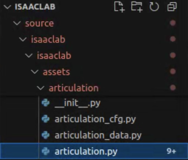
成功后将不再出现[bruce4isaaclab2.0](./bruce4isaaclab2.0/readme.html)教程末尾出现的限位报错

## 2.`velocity_env_cfg.py`
位置:`source/isaaclab_tasks/isaaclab_tasks/manager_based/locomotion/velocity/velocity_env_cfg.py`
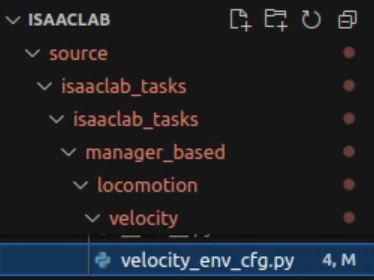

## 3.`vecenv_wrapper.py`
调整了一下手臂，使得手臂不动
位置:
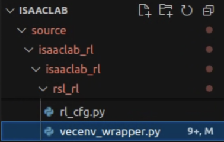

让手臂不动后，我们还希望涉及的关节从原来的16个变为10个，即去掉原来与手臂有关的6个关节

### ==手动修改on_policy_runner文件==
**这个文件在环境的包中不是很好替换，手动改三个地方**
#### 进入`on_policy_runner.py文件`
`play.py`第53行，按住Ctrl点击`OnPolicyRunner`就会跳转到`on_policy_runner.py文件`
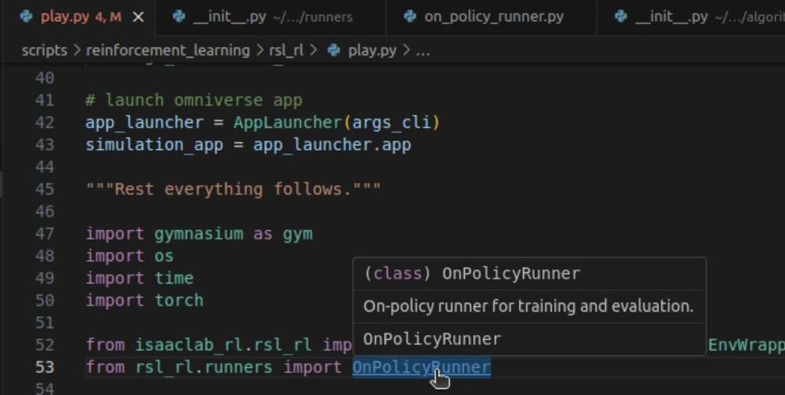
#### 在`OnPolicyRunner`类的`__init__`函数中添加`self.num_actions`并赋值为10
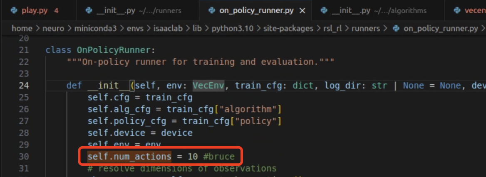
#### 两处`self.env.num_actions`替换为`self.num_actions`
1. 第40行附近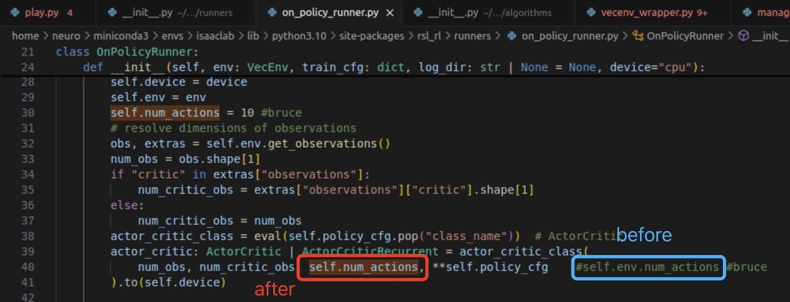
2. 第81行附近（这里action暂时打错了）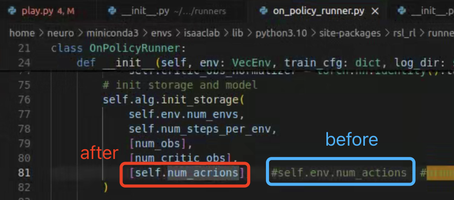

## 4.`rewards.py`
主要添加了一些奖励函数
位置:
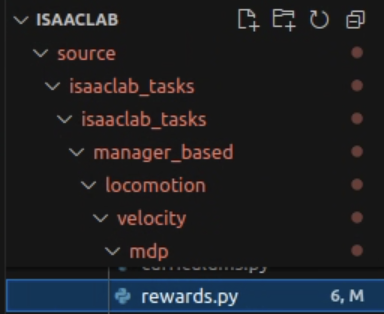

## 5.`flat_env_cfg.py`
主要调整了一下参数
位置:
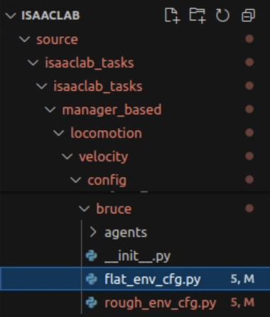

## 6.`rough_env_cfg.py`
位置:
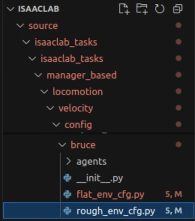

## 7.`bruce.py`
是[bruce4isaaclab2.0](./bruce4isaaclab2.0/readme.html)教程中的bruce.py文件的更新版本
位置:
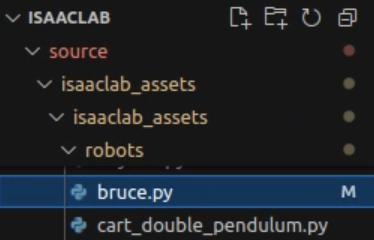

# 新加入的文件
## `bruce.py`
是一个可以直接运行的demo，不需要在终端输入--task,--num_envs等参数
**为了与上一个同名文件区分，待添加的文件放在==bruce_demo文件夹==中**
添加到scripts/demos中:
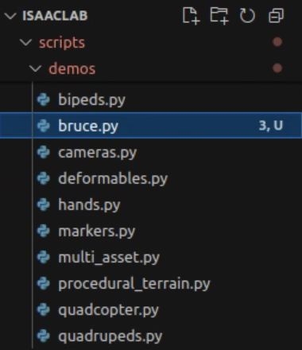
运行之后是一个可以任人摆布的机器人

# 终端运行指令
在教程[bruce4isaaclab2.0](./bruce4isaaclab2.0/readme.html)中已经了解过参数`--task`与`--num_envs`
接下来再介绍一些

## `train.py`
### 参数`max_iterations`
在`python train.py --task task_id --num_envs 4096` 后可添加`--max_iterations 100000`,因为默认的迭代次数太少了，所以我们手动设置成100000

以bruce平地行走为例：
```(Python)
python train.py --task Isaac-Velocity-Flat-Bruce-v0 --num_envs 4096 --max_iterations 100000
```

### 参数`headless`
在上一步的基础上可以添加 `--headless`，这样就不会打开模拟器，可以训得快一点

以bruce平地行走为例：
```(Python)
python train.py --task Isaac-Velocity-Flat-Bruce-v0 --num_envs 4096 --headless --max_iterations 100000
```

## `play.py`
先运行`train.py`再运行`play.py`
### 参数`load_run`与`checkpoint`
`load_run`和`checkpoint`可以实现读取储存在同级文件夹的log文件夹中的历史训练结果和模型
以bruce平地行走为例：
```(Python)
python play.py --task Isaac-Velocity-Flat-Bruce-v0 --num_envs 2  --load_run 2025-03-17_17-34-24 --checkpoint /home/neuro/IsaacLab/scripts/reinforcement_learning/rsl_rl/logs/rsl_rl/Bruce_flat/2025-03-17_17-34-24/model_250.pt
```
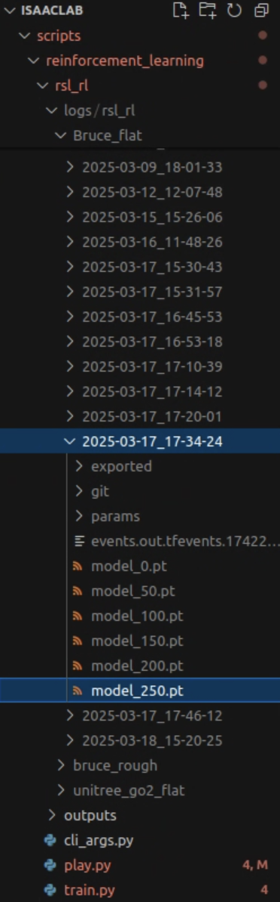
`load_run`后面写日志(log)文件名(此处是2025-03-17_17-34-24)，`checkpoint`后写模型(此处是model_250.pt)的绝对路径