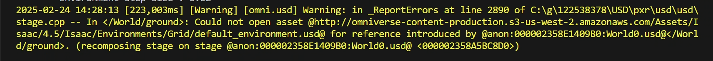

---
html:
  embed_local_images: true
  embed_svg: true
  offline: false
  toc: true

print_background: false
---

# BRUCE导入ISAAC LAB 2.0.0（基于Isaac Sim 4.5.0）

**本示例仅演示最基本的模型文件位置应该在哪，并不代表可以正式训练，仍有许多函数、参数需要补充。**

[toc]

## 1.文件位置

### 1.1 `bruce.py`

`bruce.py`定义bruce模型，如关节链接等。其中的`usd_path`路径需要修改为当前`bruce.usd`对应的路径。

- 目录位于
  `~\IsaacLab2.0.0\source\isaaclab_assets\isaaclab_assets\robots\bruce.py`

  
</br>
- 需要修改同文件夹下`__init__.py`文件以导入bruce配置。

  

### 1.2 `bruce`文件夹（包含agent、环境cfg等）

该文件夹定义学习策略cfg（即学习参数如PPO参数等）、学习环境（奖励函数、状态判断、关节、速度、力矩限位以及注册当前创建环境的id等等。

- 目录位于
  `~\IsaacLab2.0.0\source\isaaclab_tasks\isaaclab_tasks\manager_based\locomotion\velocity\config\bruce`
  

  其中红框部分即定义的该环境/该学习任务的id，后续训练`train.py`中需要指定任务，即传给`--task`的参数

### 1.3 其他需要修改的部分

#### 1.3.1 `terminations.py`

目录位于
`~\IsaacLab2.0.0\source\isaaclab\isaaclab\envs\mdp\terminations.py`
此处定义何时状态被视为：摔倒。理论来讲同文件夹下其他亦需定义，但本示例仅考虑最简单的跑通情况，后续自行补充。


红框中即为需要补充的内容：

```(Python)
def fall(env: ManagerBasedRLEnv, asset_cfg: SceneEntityCfg = SceneEntityCfg("robot")) -> torch.Tensor:
    asset: Articulation = env.scene[asset_cfg.name]
    robot_height = asset.data.root_pos_w[:,2].unsqueeze(1)
    fall = robot_height < 0.15
    # print(torch.any(fall,dim=1))
    return torch.any(fall,dim=1)
```

#### 1.3.2 `user.config.json`

如果在windows下安装，可能会出现无法获取地形asset的问题，具体报错类似如下：



此为代理问题，但win下的clash似乎无法做到完全的系统全局代理。目前仅尝试将4.5.0的`config.json`文件中链接末端4.5改为4.2，可以一定程度上解决问题（最小红框中原本为4.5）：


## 2.测试

进入目录
`~\IsaacLab2.0.0\scripts\reinforcement_learning\rsl_rl`


选中其下的`train.py`文件，右键-在集成终端中打开（目的是快速进入该目录，自己cd也行。注意你的conda环境必须激活），后输入：

```(Python)
python train.py --task Isaac-Velocity-Flat-Bruce-v0 --num_envs 10
```

- `task` 参数即为前文提到的注册的环境/学习任务id
- `num_envs`参数即仿真中使用多少个模型并行训练
- 其余参数含义自行看代码中`help`部分

顺利的话可以看到类似如下：


- 会有一个限位报错：
  
  因为目前没写真正的关节位置和限制，是随便给的。后续得补充。
